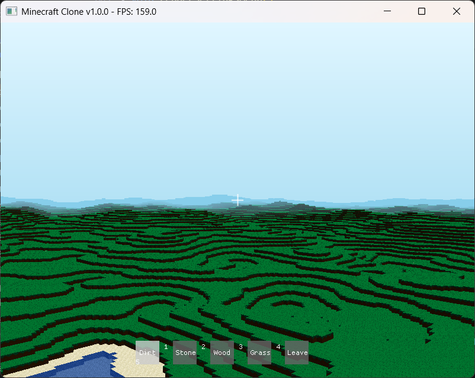

# 🎮 Minecraft Clone - Advanced Voxel World Engine

| A complete, modern OpenGL-based Minecraft clone featuring infinite proced | Script                               | Description                      | Configuration                                                                                                                |
| ------------------------------------------------------------------------- | ------------------------------------ | -------------------------------- | ---------------------------------------------------------------------------------------------------------------------------- |
| `build.bat`                                                               | **Release build** with optimizations | `-O3`, optimized for performance |
| `build_debug.bat`                                                         | **Debug build** with symbols         | `-g`, includes debugging info    |
| `run.bat`                                                                 | **Run release** executable           | Launches optimized build         |
| `run_debug.bat`                                                           | **Run debug** executable             | Launches debug build             |
| `clean.bat`                                                               | **Clean** all build artifacts        | Removes build directories        | rld generation, advanced chunk-based rendering, and comprehensive block interaction systems. Built with C++ and OpenGL 3.3+. |

   

## 🚀 Features

### 🌍 **Complete Voxel World System**

- **Infinite World Generation**: Seamless procedural terrain extending in all directions
- **Chunk-Based Architecture**: Optimized 16×16×256 chunk system with efficient loading/unloading
- **Multi-Biome Terrain**: FastNoise-powered procedural generation with varied landscapes
- **Block Diversity**: 10+ block types including grass, dirt, stone, water, sand, wood, leaves, and more

### 🎨 **Advanced Rendering Engine**

- **Modern OpenGL Pipeline**: OpenGL 3.3+ with optimized vertex buffer management
- **Frustum Culling**: Intelligent chunk rendering based on camera view
- **Transparent Water**: Proper alpha blending for realistic water rendering
- **Performance Optimized**: Sustained 60+ FPS with dynamic mesh generation throttling
- **Texture Atlas System**: Efficient texture management with atlas-based rendering

### 🎮 **Interactive Gameplay**

- **Raycasting System**: Precise block targeting and interaction
- **Block Building**: Place and destroy blocks with visual feedback
- **First-Person Controls**: Smooth WASD movement with mouse look
- **Real-Time UI**: ImGui-based interface with debug information and controls
- **Dynamic Hotbar**: Block selection with visual indicators

### ⚡ **Performance & Quality**

- **Zero Build Warnings**: Clean compilation in both Debug and Release modes
- **Optimized Mesh Generation**: Dynamic throttling prevents frame drops
- **Memory Efficient**: Smart chunk management with distance-based unloading
- **Cross-Platform Ready**: GLFW-based with MinGW64 and MSVC support

## � Screenshots



_Beautiful gradient sky system with atmospheric fog blending seamlessly into procedurally generated terrain. Features include dynamic chunk-based world generation, real-time block interaction, and optimized rendering performance._

## �📋 Prerequisites

### System Requirements

- **Operating System**: Windows 10/11 (64-bit)
- **Graphics**: OpenGL 3.3+ compatible GPU with updated drivers
- **Memory**: 4GB RAM minimum, 8GB recommended
- **Storage**: 500MB free space

### Development Tools

| Tool              | Version     | Purpose                    |
| ----------------- | ----------- | -------------------------- |
| **MinGW64**       | GCC 14.2.0+ | C++ compiler (recommended) |
| **Visual Studio** | 2022+       | Alternative C++ compiler   |
| **CMake**         | 3.16+       | Build system               |
| **Git**           | Latest      | Version control            |

## 🚀 Quick Start

### Option 1: Automated Setup (Recommended)

```powershell
# Clone the repository
git clone https://github.com/alibadawi25/Minecraft-Clone-By-Ai.git
cd Minecraft-Clone-By-Ai

# Build and run (Release mode)
./build.bat
./run.bat
```

### Option 2: Manual Build

```powershell
# Clone and navigate
git clone https://github.com/alibadawi25/Minecraft-Clone-By-Ai.git
cd Minecraft-Clone-By-Ai

# Create build directory
mkdir build
cd build

# Configure and build
cmake .. -G "MinGW Makefiles" -DCMAKE_BUILD_TYPE=Release
cmake --build . --parallel

# Run the executable
./MinecraftClone.exe
```

## 🎮 Controls & Gameplay

### Movement

| Key              | Action                            |
| ---------------- | --------------------------------- |
| **WASD**         | Move forward/backward/left/right  |
| **Mouse**        | Look around (first-person camera) |
| **Space**        | Fly up / Jump                     |
| **Shift**        | Fly down / Sneak                  |
| **Scroll Wheel** | Adjust field of view              |

### Block Interaction

| Control         | Action                        |
| --------------- | ----------------------------- |
| **Left Click**  | Break/destroy blocks          |
| **Right Click** | Place selected block          |
| **1-5 Keys**    | Select block type from hotbar |

### Interface

| Key        | Action                       |
| ---------- | ---------------------------- |
| **F1**     | Toggle UI panels             |
| **ESC**    | Toggle mouse capture/release |
| **Alt+F4** | Exit application             |

### Available Block Types

- **Dirt** (Key: 1) - Basic earth block
- **Stone** (Key: 2) - Solid rock material
- **Wood** (Key: 3) - Tree trunk blocks
- **Grass** (Key: 4) - Surface vegetation
- **Leaves** (Key: 5) - Tree foliage

## 🏗️ Build System & Development

### Build Scripts

The project includes automated build scripts for easy development:

| Script            | Description                          | Configuration                    |
| ----------------- | ------------------------------------ | -------------------------------- |
| `build.bat`       | **Release build** with optimizations | `-O3`, optimized for performance |
| `build_debug.bat` | **Debug build** with symbols         | `-g`, includes debugging info    |
| `run.bat`         | **Run release** executable           | Launches optimized build         |
| `run_debug.bat`   | **Run debug** executable             | Launches debug build             |
| `clean.bat`       | **Clean** all build artifacts        | Removes build directories        |

### Manual CMake Commands

#### Release Configuration

```powershell
mkdir build
cd build
cmake .. -G "MinGW Makefiles" -DCMAKE_BUILD_TYPE=Release
cmake --build . --parallel
```

#### Debug Configuration

```powershell
mkdir build_debug
cd build_debug
cmake .. -G "MinGW Makefiles" -DCMAKE_BUILD_TYPE=Debug
cmake --build . --parallel
```

### VS Code Integration

The project includes complete Visual Studio Code configuration:

- **🔍 IntelliSense**: Full C++ language support with path resolution
- **🔨 Build Tasks**: Integrated build system (Ctrl+Shift+P → Tasks: Run Task)
- **🐛 Debugging**: GDB debugging with breakpoint support
- **📦 Extensions**: Curated list of recommended development tools

#### Recommended Extensions

```json
{
  "recommendations": [
    "ms-vscode.cpptools", // C/C++ IntelliSense
    "ms-vscode.cmake-tools", // CMake integration
    "twxs.cmake", // CMake syntax highlighting
    "ms-vscode.hexeditor" // Binary file editing
  ]
}
```

## 📁 Project Architecture

```
ai-karim/
├── 📂 src/                     # Source code
│   ├── 📄 main.cpp            # Application entry point
│   ├── 📂 world/              # World management system
│   │   ├── world.h/.cpp       # World class and chunk management
│   │   ├── chunk.h/.cpp       # Individual chunk implementation
│   │   └── block.h/.cpp       # Block system and registry
│   ├── 📂 renderer/           # Rendering system
│   │   ├── camera.h/.cpp      # First-person camera
│   │   └── simple_shader.h/.cpp # Shader management
│   ├── 📂 input/              # Input handling
│   ├── 📂 ui/                 # User interface (ImGui)
│   └── 📂 utils/              # Utility functions
├── 📂 shaders/                # GLSL shader files
│   ├── block.vert/.frag       # Block rendering shaders
│   └── highlight.vert/.frag   # Block highlight shaders
├── 📂 assets/                 # Game assets
│   └── 📂 textures/           # Texture atlas and images
├── 📂 external/               # Third-party libraries
│   ├── 📂 glad/               # OpenGL function loader
│   ├── 📂 stb/                # Image processing
│   ├── 📂 FastNoise/          # Terrain generation
│   ├── 📂 glm/                # Mathematics library
│   └── 📂 imgui/              # Immediate mode GUI
├── 📂 .vscode/                # VS Code configuration
├── 📂 build/                  # Release build output
├── 📂 build_debug/            # Debug build output
└── 📄 CMakeLists.txt          # Build configuration
```

## 🔧 Technical Implementation

### Core Systems

#### 🌍 **World Management**

- **Chunk System**: Efficient 16×16×256 chunk architecture
- **Dynamic Loading**: Distance-based chunk loading and unloading
- **Thread Safety**: Concurrent chunk generation and mesh building
- **Memory Management**: Automatic cleanup of distant chunks

#### 🎨 **Rendering Pipeline**

- **Vertex Buffer Objects**: Optimized mesh storage and rendering
- **Frustum Culling**: Only render chunks in camera view
- **Face Culling**: Hide internal block faces for performance
- **Transparency**: Proper depth sorting for water and glass blocks

#### 🎮 **Interaction System**

- **Raycasting**: Precise block targeting using DDA algorithm
- **Visual Feedback**: Real-time block highlighting
- **Collision Detection**: Prevent invalid block placements
- **World Modification**: Efficient block updates with neighbor notifications

### Performance Features

- **⚡ Dynamic Mesh Throttling**: Limits mesh generation to maintain 60+ FPS
- **🎯 Render Distance Control**: Adjustable view distance (4-32 chunks)
- **💾 Uniform Caching**: Optimized shader uniform management
- **🔄 Background Processing**: Non-blocking chunk generation

## 📚 Documentation

### Project Documentation

- **[📝 Changelog](CHANGELOG.md)** - Version history and recent changes
- **[🗺️ Project Roadmap](ROADMAP.md)** - Future development plans and vision
- **[🔧 Development Guide](DEVELOPMENT.md)** - Comprehensive developer documentation
- **[🧹 Cleanup Summary](CLEANUP_SUMMARY.md)** - Recent code organization improvements

### Quick Reference

- **Getting Started**: Follow the Quick Start section above
- **Building Issues**: Check [Troubleshooting](#🛠️-troubleshooting) section
- **Development Setup**: See [DEVELOPMENT.md](DEVELOPMENT.md) for detailed setup
- **Contributing**: Review [DEVELOPMENT.md](DEVELOPMENT.md) contribution guidelines

### External Documentation

- **OpenGL**: [LearnOpenGL](https://learnopengl.com/) - Comprehensive tutorials
- **GLFW**: [GLFW Documentation](https://www.glfw.org/documentation.html) - Window management
- **ImGui**: [ImGui Documentation](https://github.com/ocornut/imgui) - Immediate mode GUI
- **FastNoise**: [FastNoise2](https://github.com/Auburn/FastNoise2) - Terrain generation

## 🗺️ Development Status

### ✅ **COMPLETED - Advanced Minecraft Clone**

**🎉 All core features implemented and fully functional!**

- [x] **Complete Voxel World System** with infinite terrain generation
- [x] **Chunk-Based Architecture** with optimized 16×16×256 chunks
- [x] **Multi-Biome Procedural Terrain** using FastNoise
- [x] **Block Interaction System** with raycasting and visual feedback
- [x] **Advanced Rendering Pipeline** with frustum culling and transparency
- [x] **Performance Optimization** sustaining 60+ FPS
- [x] **Complete UI System** with ImGui integration
- [x] **First-Person Controls** with smooth movement and camera
- [x] **Build System** with zero warnings in Debug and Release modes

### 🔮 **Future Enhancements**

- [ ] **Multiplayer Support** - Network synchronization and server architecture
- [ ] **Advanced Physics** - Gravity, fluid dynamics, and particle systems
- [ ] **Lighting System** - Dynamic lighting with shadows and ambient occlusion
- [ ] **Inventory Management** - Item system with crafting and storage
- [ ] **World Persistence** - Save/load world state to disk
- [ ] **Biome Expansion** - Additional biomes with unique block types
- [ ] **Sound System** - 3D audio with environmental effects
- [ ] **Mod Support** - Plugin architecture for community content

## 🛠️ Troubleshooting

### Build Issues

```powershell
# Clean build if experiencing issues
./clean.bat
./build.bat
```

### OpenGL Issues

- Ensure graphics drivers are updated
- Check OpenGL version: `glxinfo | grep "OpenGL version"` (Linux) or use GPU-Z (Windows)
- Verify GPU supports OpenGL 4.6

### Performance Issues

- Enable VSync in graphics driver settings
- Close unnecessary background applications
- Monitor GPU temperature and throttling

## 📝 Contributing

1. Fork the repository
2. Create a feature branch (`git checkout -b feature/amazing-feature`)
3. Commit changes (`git commit -m 'Add amazing feature'`)
4. Push to branch (`git push origin feature/amazing-feature`)
5. Open a Pull Request

## 📄 License

This project is licensed under the MIT License - see the LICENSE file for details.

## 🙏 Acknowledgments

- OpenGL community for excellent documentation
- GLAD project for OpenGL loading
- STB libraries for image processing
- FastNoise for procedural generation algorithms
- ImGui for immediate mode GUI framework
- GLFW for cross-platform window management
